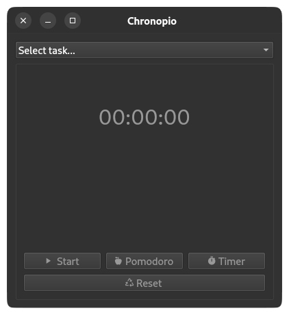

# ⏱️ Chronopio

Chronopio is a minimalist time tracker and Pomodoro timer built with PySide6 and QtAwesome.

It features:

- 🟢 A simple timer with start/stop and reset functionality  
- 🍅 A Pomodoro timer (25 minutes countdown)  
- ⏱️ A Timer mode (User-configurable interval)
- ⌛ Systray integration
- 🧮 Tasks detailed view.
- 🔁 Reset button with contextual enable/disable logic  
- 🎨 Icon-enhanced buttons using Material Design Icons (via `qtawesome`)  
- 💻 Clean and intuitive PySide6 GUI  

---

## 📸 Preview

  

---

## 🛠️ Requirements

- Python 3.9+
- [PySide6](https://pypi.org/project/PySide6/)
- [QtAwesome](https://pypi.org/project/QtAwesome/)

Install dependencies:

```bash
pip install -r requirements.txt
```

Or manually:

```bash
pip install PySide6 QtAwesome
```

---

## ▶️ Run

```bash
python3 run.py
```

---


## 💡 Notes

- Pomodoro mode hides the standard timer and vice versa.
- Reset re-enables both modes and clears the time.
- Icons from [Material Design Icons](https://materialdesignicons.com/), via `qtawesome`.

---


🤓 Why “Chronopio”?

A tribute to Julio Cortázar's imaginary creatures — “cronopios” — that live a bit distracted, a bit poetic, but always with a sense of purpose. Just like you.

---

## 📃 License

MIT License.
